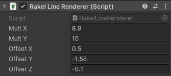
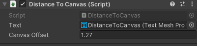

# Rakel3D
Das Projekt simuliert die Rakel-Technik unter Verwendung einer realen Rakel (Zeicheninstrument) an einer realen Wand. Das Gemalte wird durch einen Projektor auf eine Wand projiziert.

Das Projekt verwendet ein Mehrschicht Farbmodell. Dieses Modell stammt aus einem vorherigen Projekt: 

## Anforderungen
+ Unity3D (Verwendete Version: 2022.3.8f1)
+ SteamVR
    - ANMERKUNG: Beim Starten von SteamVR warten bis alle vier Basisstationen verbunden sind, dann den oberen Tracker (über der Powerbank) anschalten und anschließend den unteren. Falls die Geräte in anderer Reihenfolge gekoppelt werden, müssen bei den GameObjects "Top" und "Bottom" die Device Nummer gegebenfalls angepasst werden
+ Lighthouse Tracking
    - Vier [Lighthouses (Basestations)](https://www.vive.com/de/accessory/base-station2/)
    - Eine [Vive Pro](https://www.vive.com/de/product/vive-pro2/overview/) bzw. eine Vive Cosmos Elite verwendet --> Wird nicht beim Nutzen des Projekts getragen. Muss lediglich verbunden sein, um das Lighthouse Tracking zu ermöglichen.

+ Der Rakel Controller beinhaltet:
    - Zwei [Vive Tracker 3.0](https://www.vive.com/de/accessory/tracker3/)
    - PowerBank zur Stromversorgung des eigentlichen Controllers
    - Controller (ESP32 Mikrocontroller mit Eingabeelementen)
    - Rakel als Malwerkzeug modifiziert mit einer weichen Kante, um die Wand nicht zu schädigen

+ Dongle, um die Daten des Controllers an Unity weiterzuleiten: ESP32 per USB an Computer angeschlossen

## Innerhalb des Projekts
+ Anpassen der virtuellen Rakelkante:
    - GameObject "LineRenderer" in der Szene Offset X und Y sowie Mult X und Y bei Bedarf anpassen

     .

+ Anpassen der Entfernung zur Wand:
    - GameObject "DistanceController" Canvas Offset anpassen (momentan bei 1.27)

     .
